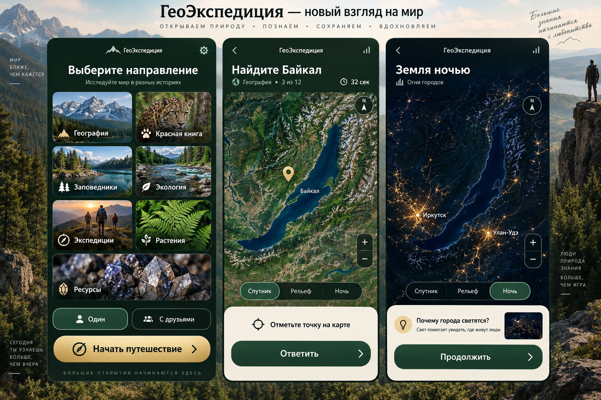
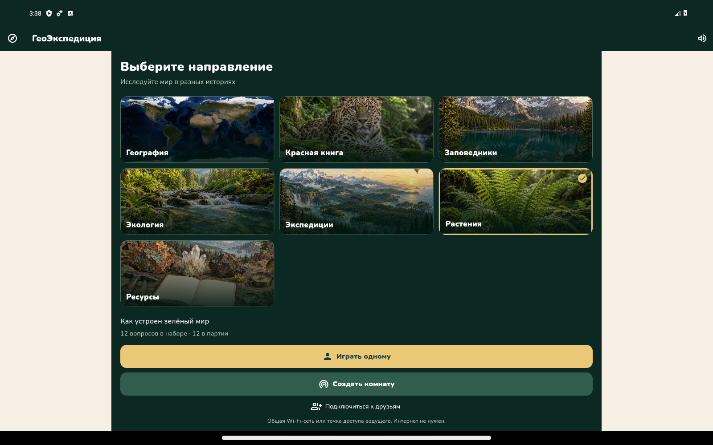
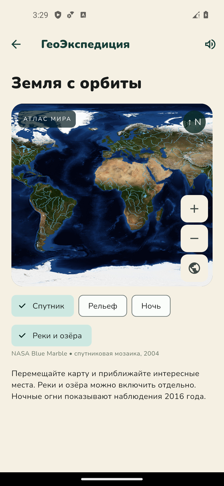
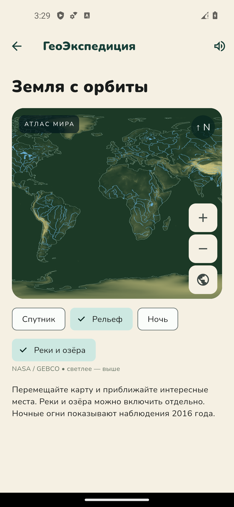
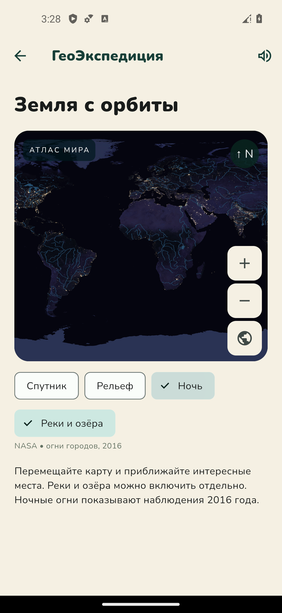
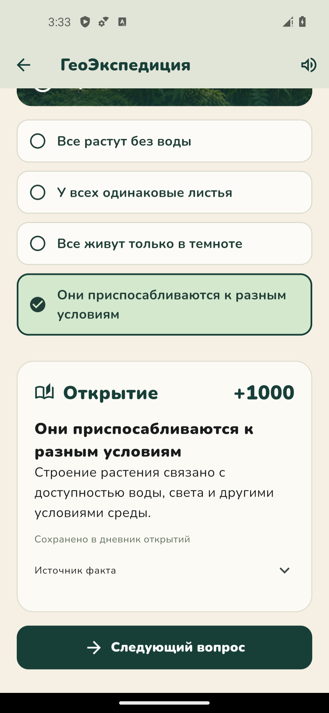
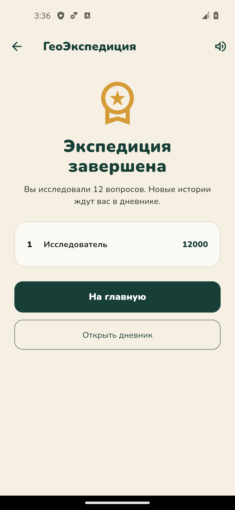

# ГеоЭкспедиция · Android 0.2.0

Семейная познавательная игра: исследуйте карту, отвечайте на вопросы и собирайте дневник открытий. Играйте самостоятельно или вместе через Wi-Fi — интернет не нужен.

**[Скачать APK 0.2.0](geo-expedition-v0.2.0.apk)** · около 80 МБ · Android 6.0+

## Визуальный референс

Концепт, который задаёт оформление игры: выбор направления, спутниковая карта и ночные огни городов. Это дизайнерский референс, а не снимок работающего приложения; расположение элементов и детализация карты в APK отличаются.



## Как выглядит приложение

Ниже — реальные скриншоты версии 0.2.0 с эмулятора Android.

### Выбор направления

Нажмите карточку темы, затем «Играть одному» или «Создать комнату». На небольшом экране кнопки запуска находятся ниже карточек — прокрутите страницу.



| Направление | Что изучаем | Вопросов в наборе |
| --- | --- | ---: |
| География | Страны, города, природные объекты и культура | 40 |
| Красная книга | Редкие животные мира и их охрана | 12 |
| Заповедники | Национальные парки и охраняемая природа | 12 |
| Экология | Природные связи, открытия и наблюдения | 12 |
| Экспедиции | Смешанный маршрут по всем направлениям | 110 |
| Растения | Устройство и приспособления растений | 12 |
| Ресурсы | Минералы, металлы и их применение | 12 |

Всего в игре **110 уникальных вопросов**; набор «Экспедиции» объединяет остальные и прежние 10 вопросов о животных. Каждая партия состоит из 12 вопросов выбранного направления.

### Спутник, рельеф и Земля ночью

Карты доступны в заданиях на поиск точки и отдельно через «Открыть атлас». Переключайте слои, включайте реки и озёра, приближайте пальцами или кнопками. Кнопка глобуса показывает весь мир.

| Спутник | Рельеф | Ночные огни |
| :---: | :---: | :---: |
|  |  |  |

Все карты встроены в APK. «Спутник» использует мозаику NASA Blue Marble 2004 года, «Рельеф» — высоты NASA/GEBCO (светлее — выше), «Ночь» — наблюдения 2016 года. Водные объекты взяты из Natural Earth.

Это **обзорный атлас**, примерно 8–11 км на пиксель на экваторе. Он не содержит всех мелких рек и улиц; ночные огни не являются прямой трансляцией. Рельеф показан цветом и светлотой, без трёхмерной модели.

### Вопрос → ответ → открытие

В зависимости от направления встречаются выбор из четырёх ответов, поиск точки на карте и геодетектив с подсказками. На вопрос даётся 45 секунд. За ответ можно получить до 1000 очков; подсказка стоит 200 очков.

После раскрытия ответа появляется короткое объяснение со ссылкой на источник. Открытые карточки сохраняются в дневнике на устройстве.

| История после ответа | Итоги экспедиции |
| :---: | :---: |
|  |  |

## Установка

1. Скачайте [geo-expedition-v0.2.0.apk](geo-expedition-v0.2.0.apk) на телефон или планшет.
2. Откройте файл и, если Android попросит, разрешите установку из используемого браузера или файлового менеджера.
3. Установите приложение и выберите направление игры.

Версию 0.2.0 можно установить поверх 0.1.x без удаления приложения и дневника. Сборка подписана тестовым ключом Android Debug и предназначена для ручной установки.

**Для совместной игры установите 0.2.0 на все устройства:** новый каталог вопросов несовместим со старыми версиями.

## Игра вместе через точку доступа или Wi-Fi

1. Ведущий включает точку доступа в настройках телефона; остальные подключаются к ней. Альтернатива — общий Wi-Fi-роутер.
2. Ведущий выбирает тему и нажимает «Создать комнату».
3. Участники выбирают «Подключиться к друзьям», вводят имя, адрес с портом и шестизначный код с экрана ведущего.
4. Ведущий запускает экспедицию; участники отвечают со своих устройств.

Сервер работает внутри телефона ведущего. В комнате предусмотрено **до 40 отвечающих участников**, ведущий управляет игрой отдельно. Реальное число подключений зависит от телефона или роутера; для большой группы предпочтителен роутер. Гостевая Wi-Fi-сеть с изоляцией устройств может блокировать подключение.

### Что видит ведущий

- Сколько участников ответили, сколько ответов осталось и время раунда.
- Статусы: «Ещё думает», «Ответ принят», «Потерял соединение».
- Сообщение «Все ответили!», однократный сигнал и выделенную кнопку «Показать результаты».

До раскрытия сами ответы скрыты. Ведущий может открыть результат досрочно; по истечении 45 секунд он раскрывается автоматически. Принятый ответ сохраняется при потере связи, а отключившийся участник без ответа остаётся в числе ожидаемых.

Держите игру открытой на устройстве ведущего: выход закрывает комнату. После короткого разрыва клиент пытается переподключиться, пока приложение открыто. Игра через интернет между разными сетями в эту версию не входит.

## Что проверено

- 31 автоматический тест: игровые правила, выбор тем, сеть, переподключение, карта, дневник и статусы ведущего.
- Анализатор Flutter завершился без замечаний; APK собран, подпись и номер версии проверены.
- На эмуляторе Android 14 без Wi-Fi и мобильной сети открыты все слои карты и полностью пройдена партия «Растения» из 12 вопросов.
- Проверены телефонная и планшетная компоновки; прежние открытия дневника сохранились после обновления.

Группа из 40 физических телефонов и совместимость со всеми версиями Android ещё не проверялись. «Красная книга» — учебная подборка редких видов мира, а не полный национальный реестр. Изображения тем художественные, созданные с ИИ; их нельзя использовать как определитель видов.

## Источники изображений и карт

Референс создан встроенным imagegen: три экрана русскоязычной семейной игры, семь направлений, спутниковый Байкал и ночные огни, тёмно-зелёное оформление с золотыми акцентами. Скриншоты остальных разделов сняты с работающего APK. Файлы изображений находятся рядом, в папке [images](images/).

- [NASA Blue Marble](https://science.nasa.gov/earth/earth-observatory/blue-marble-next-generation/base-topography-bathymetry/)
- [NASA Black Marble](https://science.nasa.gov/earth/earth-observatory/earth-at-night/maps/)
- [NASA / GEBCO — высоты](https://science.nasa.gov/earth/earth-observatory/blue-marble-next-generation/topography-bathymetry-maps/)
- [Natural Earth — условия использования](https://www.naturalearthdata.com/about/terms-of-use/)

## Контрольная сумма APK

SHA-256 файла `geo-expedition-v0.2.0.apk`:

```text
CD5731B82226D88767AD76BDC2E158484EE2FC96EADB94AD52DA0E049F07C18D
```

Старые APK 0.1.0 и 0.1.1 в этой папке сохранены для истории. Для установки используйте 0.2.0.
